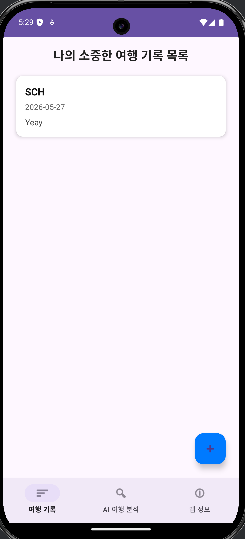
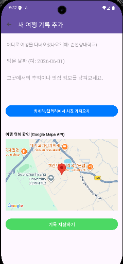
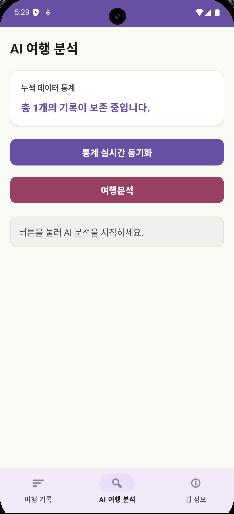
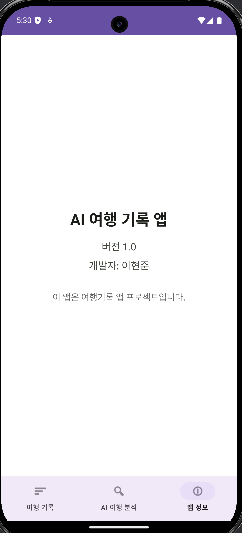

# AI 여행 기록 앱 (Travel Log with AI)

## 📖 1. 프로젝트 개요

**AI 여행 기록 앱**은 사용자의 소중한 여행 순간을 체계적으로 기록하고, AI 기술을 통해 새로운 가치를 더하는 개인 포트폴리오용 안드로이드 애플리케이션입니다. 단순한 메모 앱을 넘어, 사용자의 데이터를 기반으로 여행 패턴을 분석하고 시각화하는 지능적인 기능을 제공하는 것을 목표로 합니다.

이 프로젝트는 특히 안드로이드의 근간이 되는 데이터베이스 관리 기술(`SQLiteOpenHelper`)에 대한 깊은 이해를 바탕으로, 현대적인 비동기 처리 방식(`코루틴`)과 UI 최적화(`ListAdapter`) 기법을 적용하여 **안정성과 성능**이라는 두 마리 토끼를 모두 잡는 데 중점을 두었습니다.

---

## ✨ 2. 주요 기능 상세

###  여행 기록 관리 (CRUD)
- **완벽한 CRUD 지원**: 사용자는 여행 기록(장소, 날짜, 메모, 사진 등)을 자유롭게 **생성(Create), 조회(Read), 수정(Update), 삭제(Delete)**할 수 있습니다.
- **최적화된 목록 UI**: `RecyclerView`를 `ListAdapter`와 `DiffUtil`로 구현하여, 데이터 변경 시 전체 목록을 새로고침하는 대신 변경된 항목만 지능적으로 업데이트합니다. 이는 수백 개의 기록이 있어도 부드러운 스크롤 성능을 보장합니다.

### 📸 AI 사진 분석 및 자동 해시태그
- **온디바이스 AI 분석**: 사용자가 사진을 첨부하면, 서버 통신 없이 기기 내부의 **TensorFlow Lite 모델**이 이미지를 즉시 분석합니다. 이는 **오프라인 환경에서도 동작**하며 사용자의 데이터를 외부에 전송하지 않아 개인정보를 보호합니다.
- **지능형 태그 추천**: 사진 속 피사체(음식, 풍경 등)를 인식하여 `#수제버거`, `#카페디저트` 와 같이 연관성 높은 해시태그를 자동으로 생성 및 제안하여 사용자의 기록 과정을 돕습니다.

### 🗺️ 지도 연동 (Google Maps API)
- **위치 시각화**: 각 여행 기록에 저장된 위치 정보를 **Google Maps API**와 연동하여 지도 위에 마커로 명확하게 표시합니다. 이를 통해 사용자는 자신의 여행 동선을 시각적으로 한눈에 파악할 수 있습니다.

### 📊 데이터 기반 여행 분석
- **개인 여행 트렌드 분석**: "AI 여행 분석" 탭에서는 사용자가 기록한 모든 데이터의 **AI 해시태그 빅데이터**를 분석합니다.
- **핵심 키워드 도출**: 가장 빈번하게 등장하는 상위 키워드를 추출하여 "나의 여행 키워드는 [#맛집, #카페, #힐링] 입니다." 와 같은 개인화된 인사이트를 제공합니다.

---

## 🏛️ 3. 아키텍처 및 설계 의도

- **`SQLiteOpenHelper` 직접 구현**: ORM(객체-관계 매핑) 라이브러리인 `Room` 대신, 안드로이드의 기본 데이터베이스 클래스인 `SQLiteOpenHelper`를 직접 상속하여 구현했습니다. 이를 통해 SQL 쿼리를 직접 제어하며, 데이터베이스의 생성, 버전 관리(Migration), CRUD 트랜잭션의 동작 원리를 깊이 있게 학습하고 적용하는 것을 목표로 삼았습니다.
- **전면적인 비동기 처리**: 사용자의 UI 경험을 최우선으로 고려하여, 데이터베이스 접근, AI 이미지 분석 등 0.1초라도 지연될 수 있는 모든 작업을 **코루틴(`Coroutine`)**과 `Dispatchers`를 활용해 백그라운드 스레드에서 처리하도록 설계했습니다. 이를 통해 ANR(앱 응답 없음) 오류를 원천적으로 차단하고 항상 부드러운 화면 반응성을 유지합니다.
- **관심사 분리(SoC)**: 프로젝트의 유지보수성과 확장성을 위해 코드를 기능에 따라 아래와 같이 명확한 패키지로 분리했습니다.
  - `data`: 데이터베이스 헬퍼, 데이터 모델 등 순수한 데이터 계층
  - `ui`: Activity, Fragment, Adapter 등 사용자 인터페이스 계층
  - `utils`: AI 분석기와 같이 재사용 가능한 유틸리티 계층

---

## 🛠️ 4. 기술 스택 및 라이브러리

| 구분 | 기술 스택 |
| --- | --- |
| **Language** | Kotlin |
| **Asynchronous** | Kotlin Coroutines |
| **Database** | SQLite (with SQLiteOpenHelper) |
| **UI** | RecyclerView, ListAdapter, DiffUtil, BottomNavigationView, Fragment, ViewBinding |
| **Machine Learning** | TensorFlow Lite (On-device) |
| **Maps** | Google Maps API |

---

## 🚀 5. 시작 가이드

1. 이 레포지토리를 클론합니다:
   ```bash
   git clone https://github.com/your-username/MobileProject.git
   ```
2. Android Studio에서 프로젝트를 엽니다.
3. `local.properties` 파일에 자신의 Google Maps API 키를 추가합니다.
   ```properties
   GOOGLE_MAPS_API_KEY=YOUR_API_KEY_HERE
   ```
4. `Build` > `Make Project`를 통해 프로젝트를 빌드하고 실행합니다.

---

## 📱 6. 실행 화면

| 여행 기록 목록 | 기록 추가/수정 |
| :---: | :---: |
|  |  |
| **AI 여행 분석** | **앱 정보** |
|  |  |
